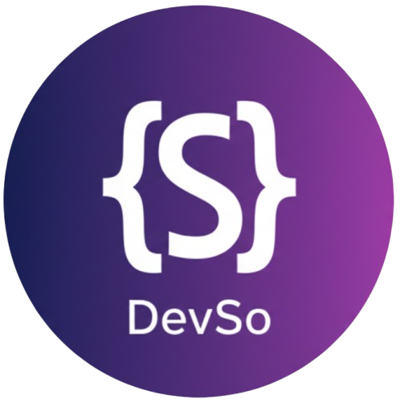

##  DevSo (Developer’s Social Network)

> "개발자를 연결하고, 함께 성장하는 공간" > 개발자 커뮤니티 SNS와 팀원 모집 플랫폼을 하나로 통합한 올인원 네트워킹 서비스입니다.

---

## 📅 프로젝트 정보

- **진행 기간**: 2025.12.22 ~ 2026.01.08 (약 3주)
- **팀 구성**: **4명(FE/BE)**
- **핵심 타겟**: 팀 프로젝트 멤버를 찾는 개발자 및 기술 네트워킹 유저
- **주요 가치**: AI 기반 자기소개 지원 및 적합도 평가를 통한 스마트 팀 빌딩

---

## 🛠 기술 스택

### Frontend

- 
- 
- 
- 
- 
- 
- 
- 

### Backend

- 
- 
- 
- 
- 
- 
- 
- 

### **선택 이유**

- **React + Vite**: 빠른 개발/빌드 속도와 컴포넌트 기반 UI 구성의 효율성
- **Spring Boot + JPA**: 도메인 모델링 및 트랜잭션 처리의 안정성 확보
- **Spring Security + JWT**: Stateless 환경에 적합한 보안 및 인증 체계 구축
- **MySQL**: 복잡한 관계형 데이터(멘션, 팔로우 등)의 효율적인 모델링

---

## 🏗 시스템 구조 및 ERD

본 프로젝트는 **MySQL Workbench**를 통해 설계된 관계형 데이터베이스를 기반으로 합니다.


**데이터 모델 설계 핵심:**

- **사용자 및 팔로우**: 유저 간 관계 지향적 네트워킹을 위한 팔로우 구조 설계
- **게시글 및 팀원 모집**: SNS 피드와 모집 게시판의 독립성 및 연관성 확보
- **실시간 채팅**: WebSocket 연동을 고려한 메시지 및 채팅방 엔티티 구성
- **데이터 보존 정책**: `deletedAt` 컬럼을 활용한 소프트 삭제 및 배치 최적화 설계

---

## 🌟 핵심 기능 및 팀원별 역할 (Technical Contributions)

### 🧑‍💻 강연주 (Team Leader) - Recruit & AI

- **팀원 모집 시스템**: 프로젝트 모집글 CRUD 개발 및 안정적인 페이징 처리 구현
- **검색 및 필터링**: 상세 조건별 모집글 필터링 및 관심 게시글 북마크 기능
- **AI 팀원 자가진단**: Gemini API를 활용한 지원자-프로젝트 간 적합도 평가 시스템 구축
- **상호작용**: 모집글 상세 페이지 내 조회수 집계 및 계층형 댓글 시스템 구현

  

### 🧑‍💻 공창근 - Auth & AI Profile

- **인증 및 보안**: Spring Security + Kakao OAuth 기반 간편 로그인/로그아웃 시스템 구축
- **AI 자기소개서**: 유저 기술 스택 분석 기반 Google Gemini API 자기소개서 자동 완성 구현
- **소셜 네트워킹**: 유저 간 팔로우/언팔로우 기능 및 개인 프로필 페이지 개발
- **개인 피드**: 작성한 SNS 게시글 및 모집글을 한눈에 확인하는 개인 포스트 페이지 구현

  

### 🧑‍💻 김재연 - Chat & Batch Optimization

- **실시간 채팅**: Spring WebSocket & STOMP 프로토콜 기반 1:1 채팅 구현
- **데이터 최적화(Batch)**: Spring Batch를 활용한 물리 삭제(Hard Delete) 프로세스 구축
- **성능 관리**: `deletedAt` 기준 만료 데이터를 새벽 시간대 자동 영구 삭제하여 DB 인덱스 및 공간 최적화

  

### 🧑‍💻 이진 - SNS & UX Optimization

- **SNS 피드**: SNS 게시글 CRUD 개발 및 카테고리/태그별 필터링 기능
- **UX 개선**: 무한 스크롤(Infinite Scroll) UI/UX 및 샘플 회전목마 형태의 대시보드 구현
- **데이터 정책**: 24시간 이내 User당 1회로 제한되는 정교한 조회수 집계 로직 적용
- **소셜 인터랙션**: 게시글 좋아요 기능 및 소통을 위한 댓글/대댓글 시스템 구현

  

---

## 🔥 주요 트러블슈팅

> 1. 효율적인 데이터 삭제 전략
>    단순 삭제가 아닌 Soft Delete(사용자 경험 유지)와 Hard Delete(Batch 성능 최적화)를 결합하여 데이터 무결성과 시스템 성능을 동시에 확보했습니다.

> 2. 조회수 신뢰성 확보Cookie와 UserID를 조합한 검증 로직을 도입하여 새로고침을 통한 중복 조회수 어뷰징 문제를 해결했습니다.

---

## ⚙️ 프로젝트 실행 방법 (Installation & Setup)

### 1) Repository Clone

먼저 Backend / Frontend 레포지토리를 각각 클론합니다.

```bash
# Backend
gitclone https://github.com/dev-network/devSO-back.git

# Frontend
gitclone https://github.com/dev-network/devSO-front.git
```

---

### 2) Database Setup

콘솔이나 데이터베이스 관리 도구(MySQL Workbench 등)에서 아래 명령어를 실행하여 데이터베이스를 생성합니다.

```sql
CREATE DATABASE devso
DEFAULTCHARACTER SET utf8mb4
COLLATE utf8mb4_unicode_ci;
```

---

### 3) API Key 발급

서비스 구동을 위해 아래 외부 API 키 발급이 필수적입니다.

- **Kakao OAuth**: 카카오 개발자 센터

  (내 애플리케이션 → 앱 설정 → 플랫폼 및 카카오 로그인 설정)

- **Google Gemini API**: Google AI Studio

  (Get API Key 메뉴에서 발급)


---

### 4) 환경 변수 설정 (Environment Variables)

보안을 위해 API Key 및 민감 정보는 환경 변수로 관리합니다.

| 변수명 | 설명 |
| --- | --- |
| `KAKAO_CLIENT_ID` | 카카오 REST API 키 |
| `KAKAO_CLIENT_SECRET` | 카카오 Client Secret |
| `GEMINI_API_KEY` | Google Gemini API 키 |

### A. 로컬 개발 환경 (IntelliJ IDEA)

1. **Run → Edit Configurations**
2. `DevSoApplication` 선택
3. **Environment variables** 항목에 위 변수 등록

### B. 실제 가동 환경 (System Environment)

- **Windows**
    - 시스템 속성 → 고급 → 환경 변수 → 시스템 변수 등록
- **Linux**

    ```bash
    export KAKAO_CLIENT_ID="발급받은키"
    export KAKAO_CLIENT_SECRET="발급받은비밀번호"
    export GEMINI_API_KEY="발급받은키"
    ```


---

### 5) 애플리케이션 실행 (Running the App)

### **Backend 실행**

```bash
cd devSO-back
./gradlew bootRun
```

- 서버 주소: `http://localhost:8080`
- Swagger 문서: `http://localhost:8080/swagger-ui.html`

---

### **Frontend 실행**

```bash
cd devSO-front
npm install
npm run dev
```

- 서비스 접속 URL: `http://localhost:5173/`

---

## 🧪 테스트 계정 안내 (Test Accounts)

회원가입 없이 주요 기능을 바로 체험할 수 있도록

아래 **테스트 계정**이 사전에 등록되어 있습니다.

| ID | Password |
| --- | --- |
| test | test1234 |
| test2 | test1234 |
| test3 | test1234 |
| test4 | test1234 |

> ⚠️ 테스트 계정은 개발 및 시연 목적으로만 사용되며,
>
>
> 데이터는 초기화되거나 변경될 수 있습니다.
>

---

## 📊 기타 (Outcomes & Future Plans)

### ✅ 성과 및 학습 (Key Achievements)

- **디자인 및 구조 최적화**: Recruit, SNS, Auth 등 전 도메인의 테마를 통일하고 효율적인 CSS 구조로 개선하여 일관된 UX를 제공합니다.
- **정책 기반 기능 동기화**: 조회수 어뷰징 방지, 좋아요, 소프트 삭제(Soft Delete) 등 복잡한 서비스 정책을 프론트와 백엔드 간 오차 없이 완벽하게 구현했습니다.
- **에디터 확장 경험**: Tiptap Editor 확장을 통해 이미지/HTML/마크다운 등 다양한 콘텐츠의 복사-붙여넣기 처리 로직을 고도화했습니다.

### 💡 아쉬운 점 및 향후 계획 (Future Roadmap)

- **데이터 기반 기능**: 팔로워 수 기준 '인기 유저' 전용 API 및 랭킹 시스템 추가
- **개인화 추천 알고리즘**: 유저 관심 태그와 활동 기반의 콘텐츠 추천 알고리즘 및 응답 속도 향상을 위한 캐싱(Redis 등) 도입
- **인프라 고도화**: 서비스 품질 유지 및 자동화를 위한 E2E 테스트 도입과 CI/CD 배포 파이프라인 구축
